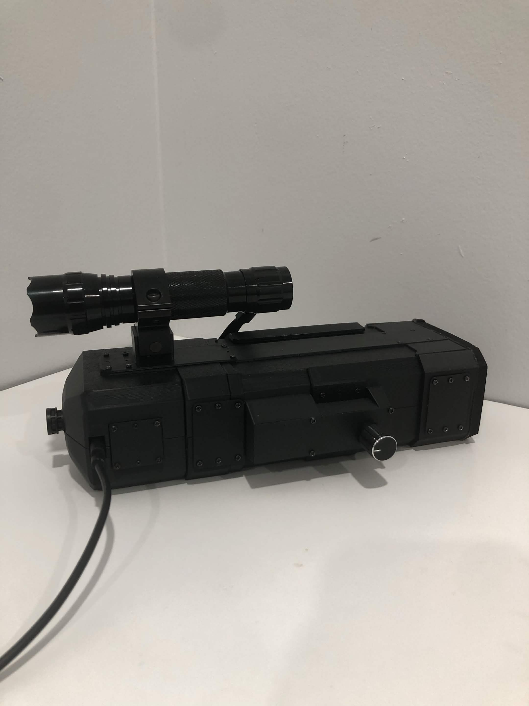
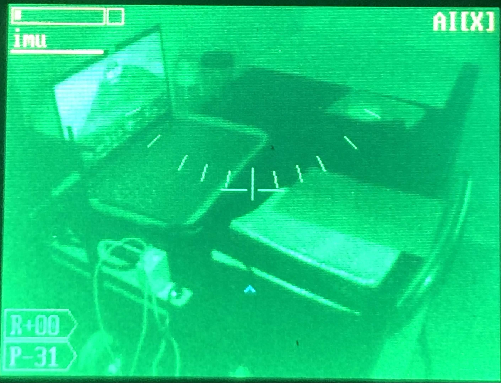
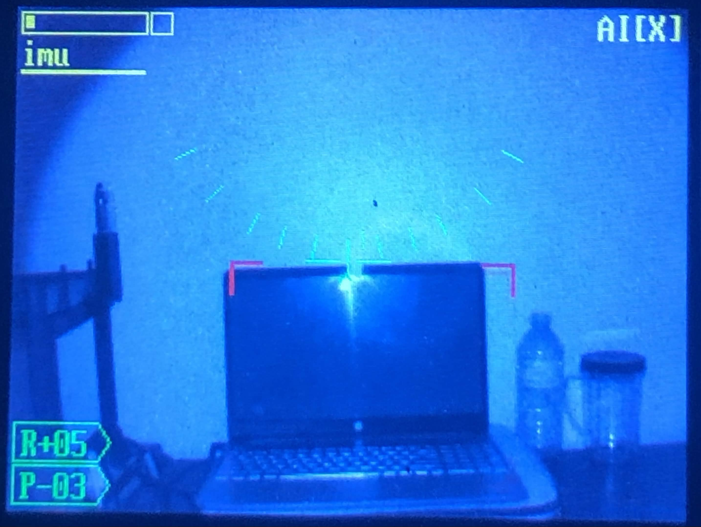
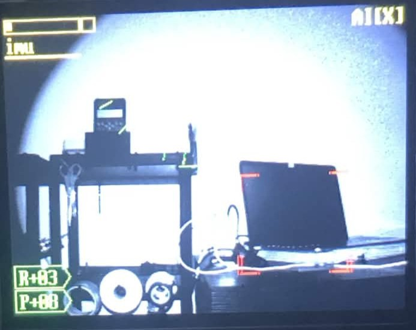
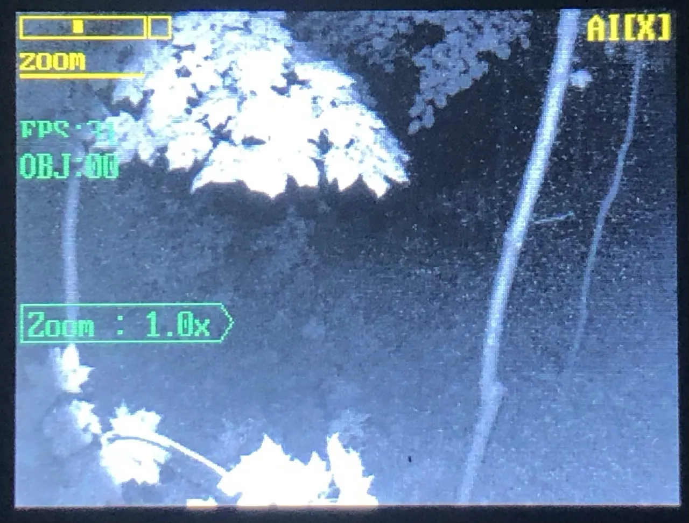

# AI-Powered Night Vision Monocular & HUD

A bare metal C night vision HUD monocular built on the Sipeed Maix Bit (Kendryte K210 dual core 64-bit RISC-V MCU). This system leverages hardware acceleration to distribute computation across **Core 0**, **Core 1**, the dedicated **Knowledge Processing Unit (KPU)**, the hardware **FFT engine**, and the camera’s internal **Image Signal Processor (ISP)**.

---

## Gallery

| | |
| :---: | :---: |
|  |  |
|  |  |

---

## Performance Metrics
By offloading heavy computations to dedicated hardware blocks and separating core tasks, the system maintains high frame rates for a fluid HUD experience:

* **~31 FPS** with real time AI object detection enabled (KPU active).
* **~48 FPS** with AI detection disabled (KPU idle).

---

## System Architecture
To achieve low latency without screen tearing, processing is distributed across specialized hardware accelerators operating in parallel:

1. OV5642 Camera ISP & DVP DMA Transfer
Image manipulation, digital zoom, color shifts and visual filters are offloaded directly to the camera's onboard Image Signal Processor (ISP) via I2C/SCCB registers. This saves CPU cycles. The processed video stream is pushed continuously into SRAM using the Digital Video Port (DVP) via Direct Memory Access (DMA).

2. Non Cached Memory Allocation
To speed up data sharing between the display, camera, CPU and KPU, DMA buffer addresses are adjusted by subtracting NON_CACHED_MEMORY_OFFSET. This maps memory directly into non cached physical SRAM (0xA0000000). It enables direct memory access between the camera DVP, AI engine and display buffer without CPU overhead.

3. KPU (Knowledge Processing Unit)
The KPU acts as an independent hardware accelerator for neural networks. It operates in parallel to the main CPU cores. It reads raw frame buffers directly from non cached memory via DMA, computes object detection in hardware, and writes bounding box coordinates and confidence scores back to memory.

4. Core 0 (Display/Camera)
Core 0 serves as the primary display and capture host. It manages DVP capture initialization and handles ISP register controls. Once a frame is captured and the KPU finishes inference, Core 0 reads the bounding box coordinates. It then draws the visual HUD elements and detection boxes onto the display buffer and sends the final frame to the ST7789 LCD via SPI.

5. Core 1 (Sensor/Audio/Telemetry)
Core 1 runs concurrently and is dedicated entirely to background telemetry and user input. It polls the MPU6050 6 axis IMU over I2C to calculate pitch and roll vectors for the artificial horizon. It also samples audio over I2S DMA into the hardware FFT accelerator for real time frequency analysis and decodes rotary encoder interrupts for HUD navigation.

---

## Hardware Specifications
| Component | Interface | K210 Function / Pins |
| :--- | :--- | :--- |
| **OV5642 Camera** | DVP | PCLK, XCLK, HSYNC, VSYNC, SCCB (I2C) |
| **ST7789 LCD** | SPI | CS, DC, WR, SCLK, Data Pins |
| **MPU6050 IMU** | I2C | SDA, SCL |
| **I2S Microphone** | I2S | WS, SCK, SD |
| **Rotary Encoder** | GPIO | Phase A, Phase B, Push Switch |

---
